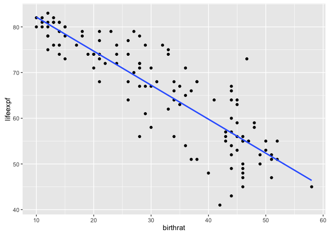

    ## 
    ##  Pearson's product-moment correlation
    ## 
    ## data:  cty122$lifeexpf and cty122$birthrat
    ## t = -19.204, df = 119, p-value < 2.2e-16
    ## alternative hypothesis: true correlation is not equal to 0
    ## 95 percent confidence interval:
    ##  -0.9072008 -0.8179588
    ## sample estimates:
    ##        cor 
    ## -0.8695051

    ## 
    ## Call:
    ## lm(formula = lifeexpf ~ birthrat, data = cty122)
    ## 
    ## Residuals:
    ##      Min       1Q   Median       3Q      Max 
    ## -17.3110  -2.6524  -0.0768   3.1784  18.1892 
    ## 
    ## Coefficients:
    ##             Estimate Std. Error t value Pr(>|t|)    
    ## (Intercept) 89.58892    1.31645   68.05   <2e-16 ***
    ## birthrat    -0.74471    0.03878  -19.20   <2e-16 ***
    ## ---
    ## Signif. codes:  0 '***' 0.001 '**' 0.01 '*' 0.05 '.' 0.1 ' ' 1
    ## 
    ## Residual standard error: 5.619 on 119 degrees of freedom
    ##   (1 observation deleted due to missingness)
    ## Multiple R-squared:  0.756,  Adjusted R-squared:  0.754 
    ## F-statistic: 368.8 on 1 and 119 DF,  p-value: < 2.2e-16

It has a strong negative correlation between life expectancy and birth
rate. The p-value is less than 0.05. Therefore, we reject the null
hypothesis and accept the alternate hypothesis.

    ##       1 
    ## 70.9711

    ## Warning: Removed 1 rows containing non-finite values (stat_smooth).

  
The assumption is that there is correlation between lifeexpf and
birthrat. But this does not imply there is casuation.
